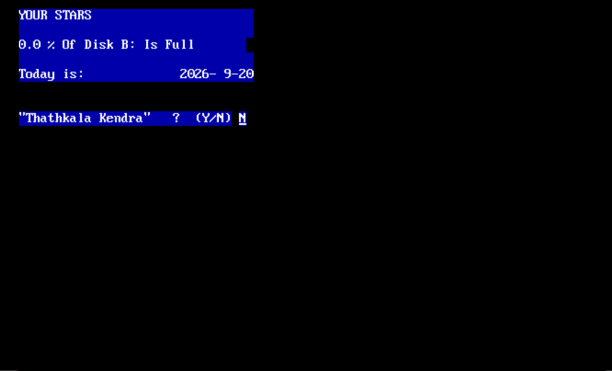

# STAR.EXE — Original Binary & Reverse-Engineering Archive

This is the **frozen reverse-engineering debris** of a 16-bit MS-DOS Sri Lankan
Vedic astrology program (`STAR.EXE`), whose original author is unknown and whose
source code was never available. The program was freely distributed in Sri Lanka
and fell out of use only because modern operating systems can no longer run
16-bit DOS binaries.

This archive is **not built, not tested, and not re-linked** into the modern
port at [github.com/madurapa/star-horoscope](https://github.com/madurapa/star-horoscope).
It exists for provenance and arbitration only — a reference copy of the
original binary and the extractions that drove the port.

### Start screen

The program's opening screen (the first thing shown when you run `STAR.EXE`
in DOSBox-X):



The original greets with a full input form — name, birth date/time, city
selector, and a `S`/`N` prompt for Sidhanta/Nirayana mode. All 19 subsequent
screens reproduce this exact flow.

## What lives here

| Path | Contents |
|---|---|
| `STAR.EXE` | The 16-bit DOS binary. Run via [DOSBox-X](https://github.com/joncampbell123/dosbox-x): `dosbox-x STAR.EXE` |
| `STAR.EXE.i64`, `STAR.EXE.idc` | [IDA Pro](https://hex-rays.com/ida-pro/) database artifacts |
| `STAR.EXE.asm` | Full disassembly (67,917 lines, base `1000h`, entry `1000:A46`), produced by IDA Pro 7.x |
| `full_analysis_listing.asm` | Publics/symbols map only |
| `binary_blueprint.json` | Extracted string/layout blueprint (352 strings, 32 routines) |
| `STAR.EXE_export_for_ai/` | IDA Export for AI: one `.asm` per failed decompilation, `function_index.txt`, `strings.txt`, `imports.txt`, `exports.txt`, `pointers.txt`, `memory/` hexdumps |
| `scripts/` | One-shot extraction harnesses: `extract_all.py`, `dump_*.py`, `r2_stage*.py`, `expB.py`/`expC.py` (DOSBox drivers), `extract_strings.py`, `real48.py` (Real48 decoder) |
| `r2_out/` | Unreferenced radare2 output |

The IDA Pro export (`STAR.EXE_export_for_ai/AGENTS.md`) documents 165 functions in
**legacy mode** (single file per function), with metadata headers recording
function name, address, callers/callees. Note: the IDA FLIRT analysis swapped
`@Sin`/`@Cos` names globally — this is a known critical porting detail, not
an extraction bug.

### Running the original

To run the actual DOS binary (e.g. for side-by-side comparison against the
modern port), use [DOSBox-X](https://github.com/joncampbell123/dosbox-x) with
the archived copy here:

```bash
dosbox-x STAR.EXE
```

See `start-screen.png` above for the opening screen. No configuration is
needed — the binary is self-contained (Turbo Pascal runtime linked in). For
automated capture runs (differential fuzzing, golden-file re-baselining), the
main port's `tools/` directory drives DOSBox-X headlessly against this file.

## Implementation language

The original binary was written in **Turbo Pascal** (Borland, 16-bit MS-DOS),
targeting 8086/8088 real-mode DOS. The port reproduces its behavior in modern
C++20 — no original source was ever available; everything was recovered from the
disassembly. Key language/runtime artifacts recovered from `STAR.EXE.asm`:

- **Real48** — Borland's 6-byte extended-precision floating point (40-bit
  effective mantissa, exponent bias 128, mantissa = 0.5 + last-byte/256 for
  `SI=0` constants). Round-half-even per operation. The `real48.py` decoder
  in `scripts/` validates exact real48 decode on canonical constants
  (1.0, 2.0, 3.0, 6.0, 60.0, 120.0, 5.5, 12.0, 30.0, 100.0, 365.25,
  30.6001, 1720994.5, 24110.54541, 8640184.812866). Returned in `AX:BX:DX`,
  compared as `AX:BX:DX` vs `CX:SI:DI` via `@__Cmp$q4Realt1`.
- **ShortString** — Pascal length-prefixed strings (1-byte length + chars),
  all 11-byte city/label tables and the 27-entry YONI/RUXHA arrays are inline
  literals in the code segment. 400 ShortStrings were recovered.
- **Runtime calls** (visible in the disassembly call census):
  - Arithmetic: `@$brmul`, `@$brdiv`, `@$brplu`, `@$brmin` (Real48 ops)
  - Conversions: `@Real$q7Longint`, `@Int`, `@Trunc`, `@Round`, `@Frac`
  - Trig: `@Sin`, `@Cos`, `@ArcTan`, `@Sqrt`, `@Exp`
  - Output: `@WriteLn`, `@Write`, `GOTOXY` (CRT unit)
  - Input: `ReadKey`, `UpCase`, `Read Longint`, `Read Real`
- **Critical porting detail**: the IDA FLIRT analysis swapped `@Sin`→cosine
  and `@Cos`→sine globally. The `sub_220B3` ephemeris census (21 Sin / 25 Cos
  call sites) only closes to <0.7" on 13 bodies when read under this swap.
  The export-for-AI `AGENTS.md` substitution mandate assumes a direct mapping
  (it does **not**) — empirical evidence rules.

The port maps these to standard `<cmath>` / `<iostream>` / `<string>`
equivalents at the engine seam (`src/Engine.hpp`), keeping the Real48 constants
bit-exact where they matter (JD path, sunrise mechanism) and double-precision
everywhere else (sub-arcsecond residuals are documented, not silent).

## What the reverse-engineering recovered

The original binary computes Sri Lankan Vedic horoscopes with these proven
routines (addresses in the disassembly):

- **`sub_2564E`** — Meeus Gregorian Julian Date: `JD = f(Y, M, D.frac)` with
  constants 100.0, 4.0, 2.0, 365.25, 30.6001, 1720994.5.
- **PROGRAM `0x1159D–0x118EA`** — IAU GMST block: `GMST0 = 24110.54541 +
  8640184.812866*T + 0.093104*T² - 0.0000062*T³`; LMST composes birth + UT
  + longitude. The GMST constant `24110.54541` differs from Meeus's `.54841`
  and is replicated as-is.
- **`sub_15FF8`** — fractional-year → Y/M/D splitter (Trunc/Trunc/Round +
  30-day month borrowing).
- **`sub_21EE1`** — H/M/S display splitter (Int/Int/Round + 59.99 carry
  threshold, banker's rounding).
- **`sub_220B3`** — planetary ephemeris engine (21 Sin, 25 Cos — read under
  the swap as cos/sin — 99 mul, 41 div, 2 Sqrt, 4 ArcTan).
- **`sub_18760`** — Lagna/ascendant engine (11 Sin, 10 Cos, 5 ArcTan).
- **`sub_23A58`** — nakshatra/pada finder + avastha dispatch:
  `idx = (DF4·DF6·E00 + E02 + DF8 + DFA) mod 12`.
- **`sub_1633A`** — Vimshottari dasa timeline (lord table Ravi 6 … Sikuru 20).
- **`sub_1D989`** — Kendraya ASCII chart renderer (GOTOXY + glyph writes).
- **`sub_1CBB2`** — string-concat chart builder.

The binary computes in **Borland Real48** (40-bit effective mantissa,
40-bit exponent bias 128). `dseg` is pure BSS (`?`); all tables live as inline
Pascal `ShortString` literals in the code segment, length-prefixed and labeled
by IDA. 400 strings were recovered by `extract_strings.py` /
`real48.py`. All 11-byte city/label tables, 27 YONI/RUXHA attribute tables,
yoga/karana/tithi/amsha names, and the 165-function disassembly are present in
the asm. See **Implementation Language** above for the Real48/ShortString/Turbo
Pascal runtime mapping.

## Deliberately reproduced quirks (fidelity contract)

The modern port reproduces these binary-literal behaviors (documented in
[`docs/quirks.md`](https://github.com/madurapa/star-horoscope/blob/main/docs/quirks.md)).
They are not bugs in this port; they are the contract — changing a number
breaks the golden-file gate.

- **Non-carry seconds**: degrees split without carrying seconds into minutes
  (e.g. Shani `213:52:60`). Lagna never wraps down; negatives wrap up via
  `normUp`.
- **59.99 carry threshold**: time display promotes at ≥59.99, banker's-rounded.
- **JD rounds half-to-odd** (not half-even): glibc `printf` cannot be used.
- **30-day month borrowing** in dasa ages.
- **23|24 balance razor**: display shows balance `2-0-23` while the table age
  is `2-0-24`; the engine Moon sits 0.63" under the screen value.
- **City 13 mismatch**: slot labeled `MATHARA` but carries Batticaloa
  coordinates (7°40′/81°43′).
- **City 14**: labeled `BADULLA` but coordinates identify it as Batticaloa.
- Binary spellings kept verbatim: `NRAYANA` (Nirayana), `Chadra` (Moon,
  load-bearing for the hora remapping chain), `Rav1` (Ravi, digit-one typo),
  `Aakasha` (double-a), `Urenus`/`Neptun`, `Pluuto`, city labels
  `CLOMBO`, `A"PURA`, `K"GALA`, `POLONARU`.
- **Yoni field-width**: stored 12-char `ShortString`, displayed 10 chars.
- **Gana Keti nondeterminism**: Keti matches no Gana set; observed DOS outputs
  are city-dependent (Raxha ×6, Maanusha ×1, blank ×2). Port returns majority
  (Raxha).
- **Blank Linga for Siyavsa**: the `nak == 28` check is unreachable (probable
  typo for 24); Siyavsa yields a blank Linga.
- **Misplaced fixed karanas**: the dispatch table deviates from textbooks.

## Relationship to the modern port

The modern port lives at [github.com/madurapa/star-horoscope](https://github.com/madurapa/star-horoscope).
This table summarizes the relationship:

| Aspect | This archive | [star-horoscope](https://github.com/madurapa/star-horoscope) (the port) |
|---|---|---|
| Role | Frozen extraction debris + original binary | Active C++ console app |
| Build status | Never compiled, never re-linked | Builds with CMake; `--verify` → `VERIFY_ALL_GREEN` |
| Ground truth source | Original DOS binary via DOSBox captures | Golden screen files (`tests/screens/`) |
| Extraction tooling | `scripts/*.py` (run once, kept for record) | `tools/check_extraction.py` only consumer (reads asm text) |
| Quirk handling | Binary-literal reference | [Deliberately reproduced](https://github.com/madurapa/star-horoscope/blob/main/docs/quirks.md) |

The re-baselining rule: golden files change **only** by explicit re-baselining
with recorded justification. Never edit expectations to match new code. If
disassembly is ever needed again, use free tooling (Ghidra or radare2) — the
proprietary tools that produced this archive have no place in the pipeline.

## Tools used

| Tool | Purpose | Link |
|---|---|---|
| [IDA Pro](https://hex-rays.com/ida-pro/) 7.x | Disassembly + FLIRT analysis → `STAR.EXE.asm`, `.i64`, `.idc`, `STAR.EXE_export_for_ai/` | https://hex-rays.com/ida-pro |
| [radare2](https://rada.re/n/) 5.9.8 + `r2pipe` | Supplementary function/string inventory, byte-level search for the Real→string pipeline (`scripts/r2_stage*.py`) | https://rada.re/n |
| [DOSBox-X](https://github.com/joncampbell123/dosbox-x) | Running the DOS binary for screen capture; scripted via `dosbox-automation` 0.85.1 for live-memory probing | https://github.com/joncampbell123/dosbox-x |
| [Python](https://python.org/) 3.8 | Extraction scripts (`scripts/*.py`): `extract_strings.py`, `real48.py`, `dump_*.py`, `expB.py`/`expC.py` | https://python.org |

- **IDA Pro** is the proprietary tool that produced the full disassembly,
  function index, string table, and memory hexdumps. Its FLIRT analysis
  swapped `@Sin`/`@Cos` globally — the single most important porting detail
  in this archive (see **Implementation language**).
- **radare2** was used for targeted byte-search and scriptable disassembly of
  the Borland Real→string print pipeline (rounder at `0x16FCF`, producer at
  `0x170C7`, scaler at `0x1723C`). `r2_out/` holds leftover output.
- **Ghidra** was **not** used for this archive. It is listed in the port's
  [AGENTS.md](https://github.com/madurapa/star-horoscope/blob/main/AGENTS.md)
  as the recommended free alternative for any future disassembly need (IDA Pro
  is proprietary; Ghidra and radare2 are both free).

## License

The original binary is unlicensed freeware (abandonware). This archive is
preserved for reference.
